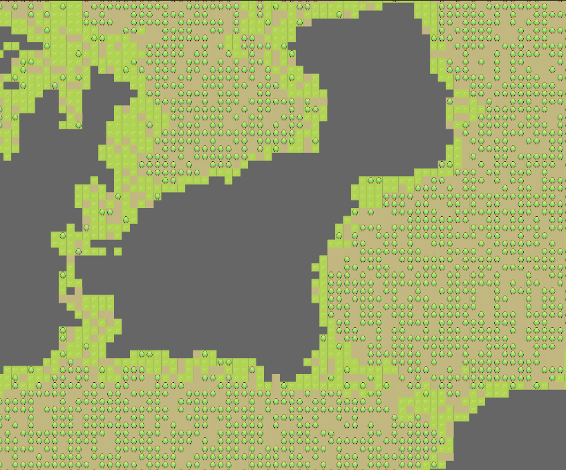
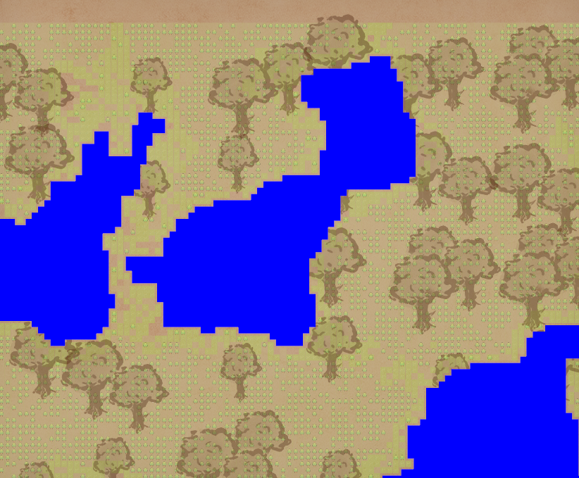
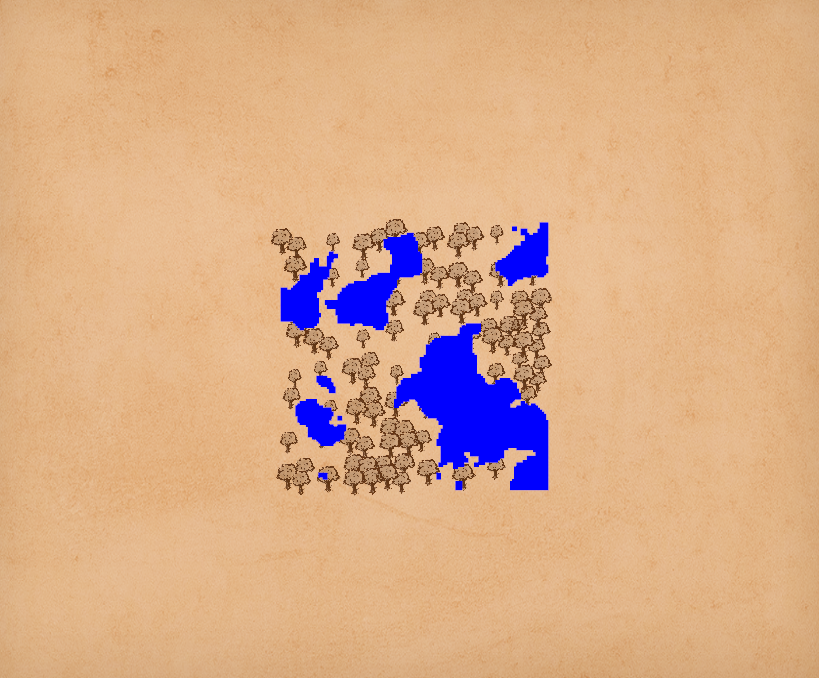

A world generator and explorer. With client and server part. Progressive load and adaptive scale.

## Dev

Build a map (add `--lakes` for lake computing, but it is experimental) :

    cargo run --bin generate 64 64 0.005 0.005 0.05 0.05 2 world.bin map.bin

Start GUI : 

    cargo run --bin neoroll_gui --release

Move map by left click drag and zoom in/out with mouse wheel.
